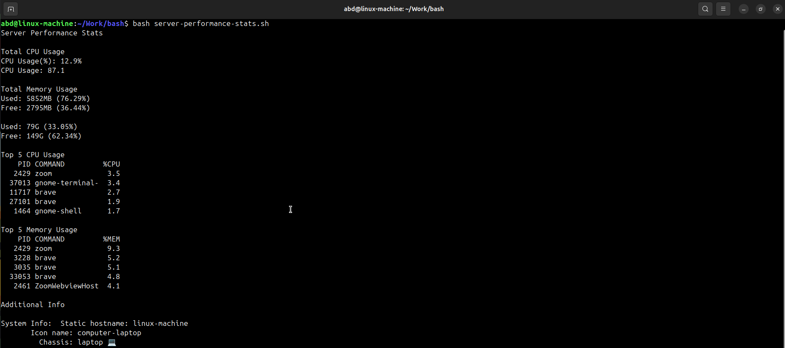

# Server Performance Stats

A bash written scripts used to display stats of your system like cpu usage, memory usage and etc

## Description

This repository contains scripts and tools for monitoring and analyzing server performance. It includes utilities for tracking CPU, memory, disk usage, and other system metrics.

## Installation

1. Clone the repository:
   ```bash
   git clone https://github.com/Abdullah021Siraj/server-performance-stats.git
    ```
   2. Navigate to the project directory and excute by using following command (on bash):
  
   ```bash
    bash server-performance-stats.sh
   ```
   3. View results and analyze server performance.
  
      

## Contributing
Contributions are welcome! If you'd like to contribute, please fork the repository and create a pull request.

### License
This project is licensed under the MIT License.

### Contact

GitHub: @Abdullah021Siraj
Email: dev.abdullah21@gmail.com

#### IB: https://roadmap.sh/projects/server-stats
      

